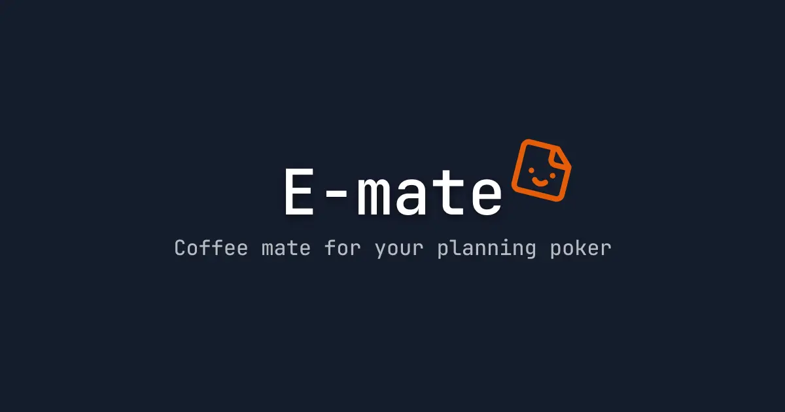

# E-mate: Your Coffee Mate for Planning Poker



E-mate is a web application that simplifies the process of planning poker sessions. It provides a user-friendly interface for participants to vote on project estimates, making it easier to reach consensus and make informed decisions.

## Prerequisites

- Node 22.14.0
- pnpm 9.14.2
- Firebase CLI

## Installation

1. Clone the repository:

```bash
git clone https://github.com/peeranat-dan/scrum-poker.git
```

2.  Navigate to the project directory:

```bash
cd scrum-poker
```

3. Install dependencies:

```bash
pnpm install
```

## Setup

1. Create Firebase project

2. Create a `.env` file in the root directory and add the Firebase configuration to it as stated in the `.env.example` file.

3. Start the development server:

```bash
pnpm dev
```

4. Open your browser and navigate to `http://localhost:5173` to access the application.

## Features

1. **Create Session:** Create a new planning poker session with fibonacci or t-shirt sizes.
2. **Invite Players:** Payers can share the session link to invite other participants.
3. **Join Session:** Players can join a session using the provided link.
4. **Vote:** Participants can vote on project estimates using the provided options.
5. **Reveal Vote:** Room owner can reveal the votes of all participants.
6. **Remove Player:** Room owner can remove players from the session.
7. **Vote Results:** All players can see the results of the voting session including the average vote and the number of votes for each option.
8. **Reset Vote:** Room owner can reset the voting session.
9. **Terminate Session:** Room owner can terminate the session.
10. **Account Settings:**
    - Link with Google
    - Sign out

## Contributing

Please refer to the [CONTRIBUTING.md](CONTRIBUTING.md) file for more information on how to contribute to the project.
